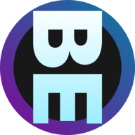
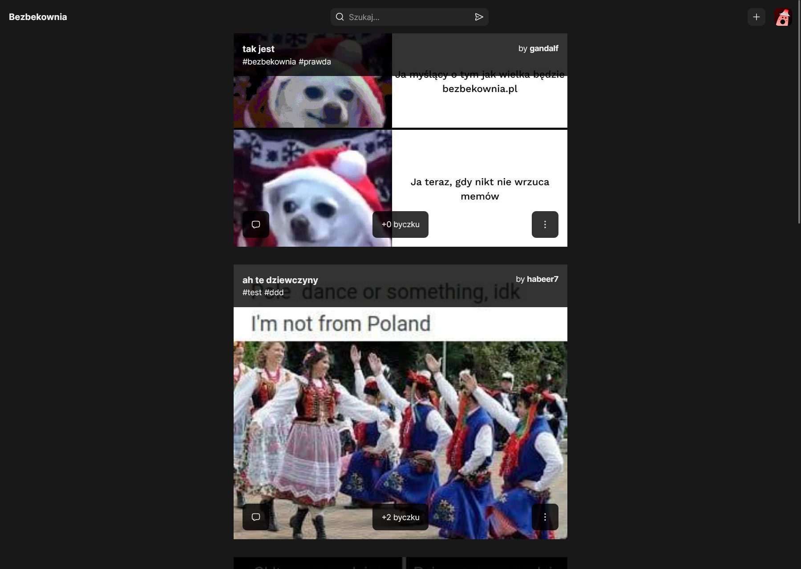

 

  

  <h3 align="center">Bezbekownia</h3>

  

    Memes controls the world 😎
     
     
    Demo cannot be shared because I have problems with deploying Strapi API 😐
  

## About The Project

Another website with memes.
I'm unable to finish this project due to no-skills in deploying Strapi API to for example Heroku.

## Built With

* [React](https://reactjs.org/)
* [styled-components](https://styled-components.com/)
* [React Router](https://reactrouterdotcom.fly.dev/)
* [Strapi](https://strapi.io/)

## License

Distributed under the GNU General Public License v3.0. See [LICENSE](https://github.com/sebastianhaber/Bezbekownia/blob/main/LICENSE.md) for more information.

## Authors

* **Sebastian Haber** - *Frontend Dev*
